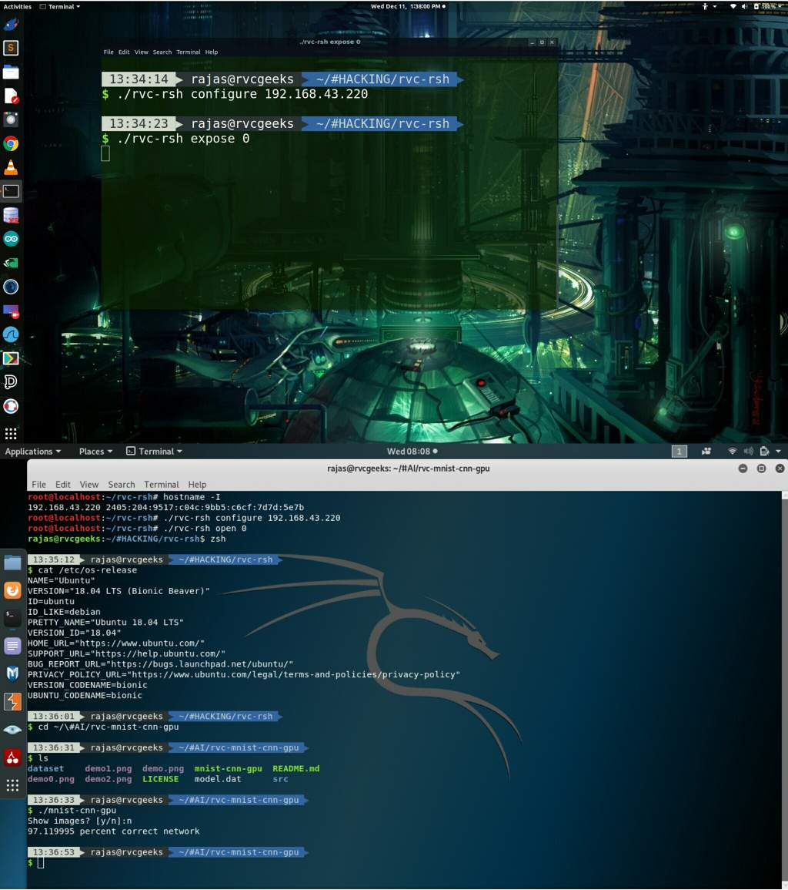

# Rvc Reverse shell

A script for creating a everse shell tunnel for linux servers 
Not actual rsh that uses RCE for injecting the RSH vulnerability.



## Features

1) Complete control of remote shell including ctrl+.. signals.
2) Supports interaction with text editors like nano, vim, emacs on remote shell as well !!
3) Auto tab completion supported.
4) Ansi color output and characters supported.
5) Dynamic communiation with the launched command.
6) Install and uninstall as a systemd service on target with autostart on boot.
7) Target RSH client always tries every 5 seconds to reconnect to the hacker server.
8) Handles ip address and port number things by itself. Automatically gets the hacker ip address
9) A connection is recognized by target pc id which we would assign, Just to mention the pc id.
10) Less bandwidth consumption and never hangs up.

## Getting Started

These instructions will get you a copy of the project up and running on your local machine for development and testing purposes. See deployment for notes on how to deploy the project on a live system.

### Prerequisites

This script was tested on Ubuntu 18.04 LTS and Kali Linux 2019.3
However this script needs some basic bash primitives in a normal linux distribution.

Server side:: Target side (acting as reverse Client)
1) python (2 or 3)
2) stty (for setting terminal window)
3) systemctl service support (for installation and autostart)

Client side:: Hacker side (acting as reverse Server)
1) python (2 or 3)
2) stty (for getting hacker terminal sizes)
3) awk interpreter and hostname utility

## Deployment

The following steps will guide you setting up a Reverse Shell between two pcs in same network

1) On hacker terminal run
```
./rvc-rsh configure
```
to set the reverse shell to connect to the hacker ip address 
2) Copy this file on Target pc and either install (run as root) or expose its terminal to hacker pc. Run
```
./rvc-rsh install (pc id)
or
./rvc-rsh expose (pc id)
```
Generally in computer labs connected with LAN the computers are labelled as pc0 pc1 pc2 etc..
this pc id refers to same kind of number through which you will identify which shell to recieve connection from.
If in case you have multiple rsh clients waiting for you on network.
In this script a base port (1234) is assigned and communication for a pc id x will occur through port no (1234 + x)
to distinguish between multiple rsh sessions on same network if they exist.
Just remember for now the script supports only one rsh client install per target pc if you want to.
3) on hacker terminal to open a client bearing some (pc id) run
```
./rvc-rsh open (pc id)
```
This will establish a TCP connection between the hacker as a server shell and the site as the client shell.
And MAGIC !! you will entirely get the remote console with all above mentioned features !!

## Author

* **Rajas Chavadekar** 

## License

This project is licensed under the MIT License - see the [LICENSE](LICENSE) file for details

